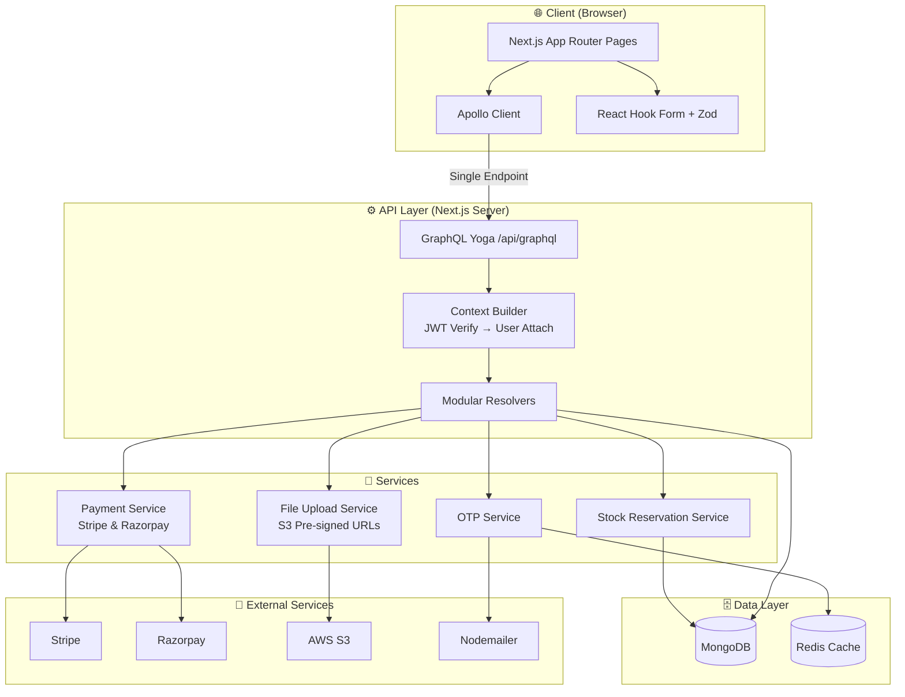
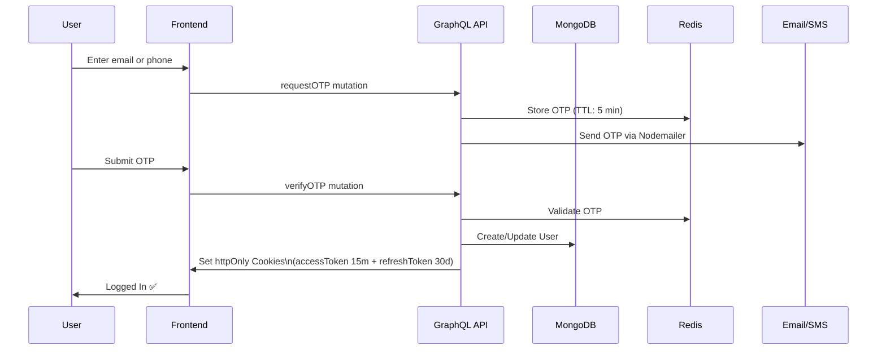
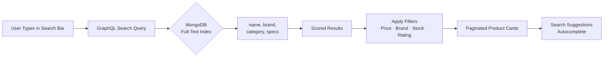
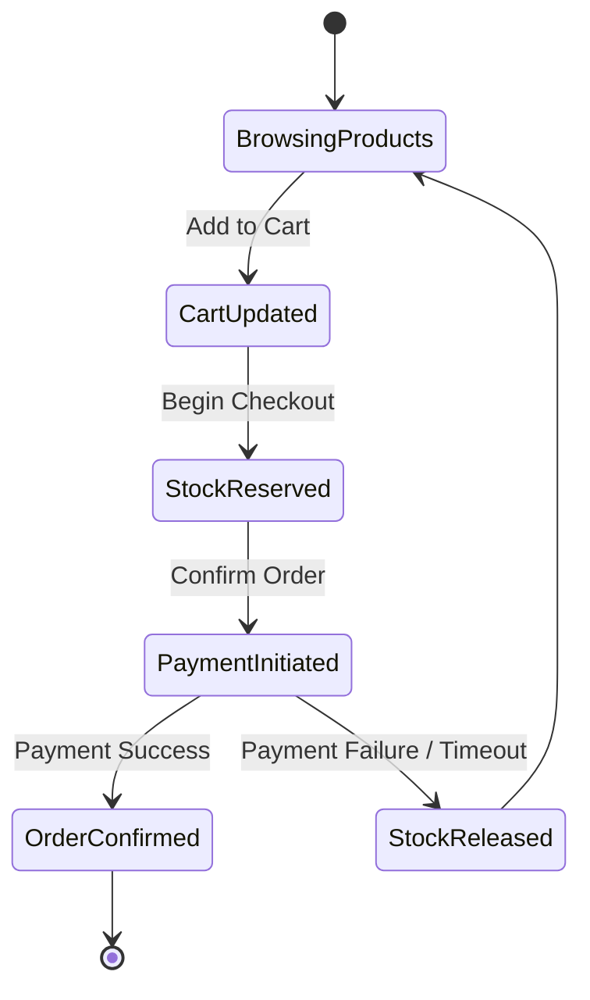
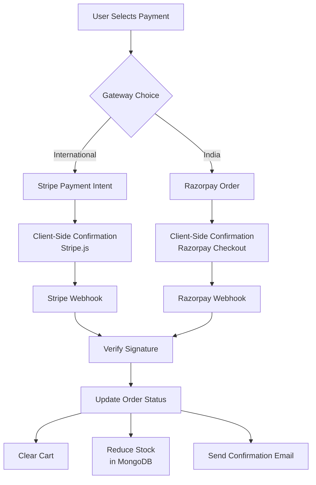
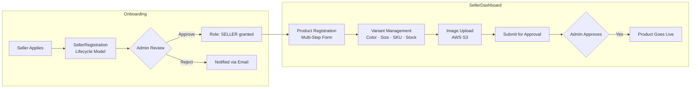
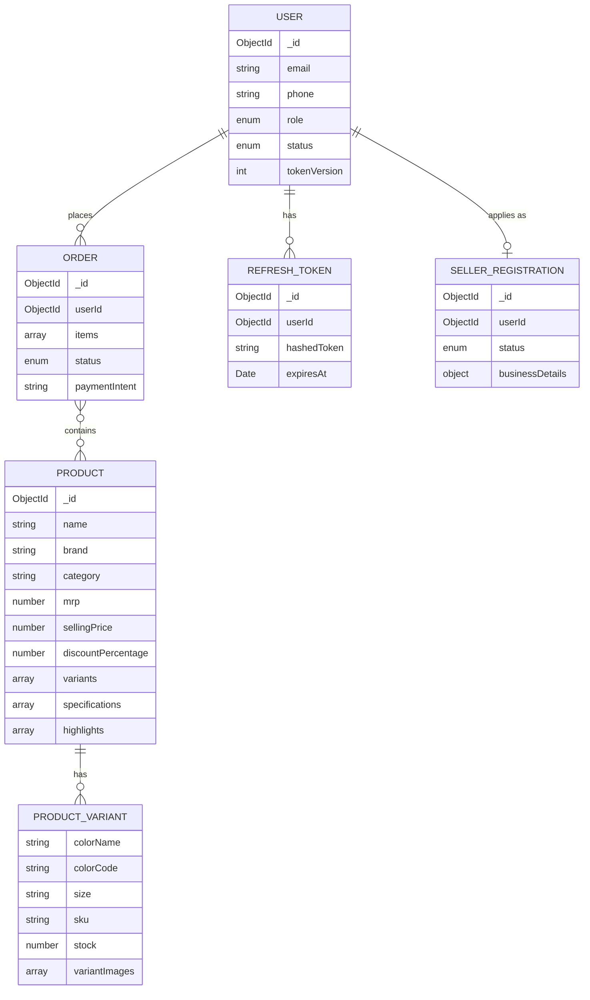

<div align="center">


# 🛍️ Zynora — Full-Stack Multi-Vendor Marketplace

> A production-grade, full-stack e-commerce marketplace built with **Next.js 15**, **GraphQL**, **MongoDB**, and **TypeScript** — handling everything from secure OTP authentication to real-time stock reservation, dual payment gateways, and a complete vendor portal.

</div>

---

## 📌 Table of Contents

- [Why Zynora?](#-why-zynora)
- [Tech Stack](#-tech-stack)
- [System Architecture](#-system-architecture)
- [Core Features](#-core-features)
  - [Authentication & Security](#-1-authentication--security)
  - [Product Catalog & Search](#-2-product-catalog--search)
  - [Shopping Cart & Checkout](#-3-shopping-cart--checkout)
  - [Payment Processing](#-4-payment-processing)
  - [Seller / Vendor Portal](#-5-seller--vendor-portal)
  - [File Uploads & Media](#-6-file-uploads--media)
  - [Caching & Performance](#-7-caching--performance)
- [Database Design](#-database-design)
- [GraphQL API Design](#-graphql-api-design)
- [Project Structure](#-project-structure)
- [Getting Started](#-getting-started)

---

## 🚀 Why Zynora?

Zynora is not a tutorial project. It is a **production-ready marketplace** that solves real-world engineering challenges:

| Challenge | How Zynora Solves It |
|---|---|
| Secure sessions without passwords | OTP-based login with rotating JWT tokens in `httpOnly` cookies |
| Race conditions on inventory | Atomic stock reservation service during checkout |
| Session persistence across tabs | Apollo Client `ErrorLink` intercepts 401s and silently refreshes tokens |
| Multi-vendor onboarding | Lifecycle-managed seller and product registration approval flows |
| Scalable media storage | AWS S3 pre-signed URLs for direct client-side uploads |
| Fraud prevention | FingerprintJS device tracking on every session |
| Fast product search | MongoDB full-text indexes on name, brand, category, and specs |

---

## 🛠️ Tech Stack

| Layer | Technology |
|---|---|
| **Framework** | Next.js 15 (App Router) + React 19 |
| **Language** | TypeScript (strict mode) |
| **API** | GraphQL Yoga (single `/api/graphql` endpoint) |
| **ORM / Database** | Mongoose + MongoDB |
| **Client State** | Apollo Client (GraphQL cache) |
| **Forms** | React Hook Form + Zod validation |
| **Styling** | Tailwind CSS v4 + Framer Motion + Radix UI |
| **Auth** | Custom JWT (Argon2 hashing) + OTP via Nodemailer |
| **Payments** | Stripe + Razorpay (dual gateway) |
| **Storage** | AWS S3 + Cloudinary |
| **Caching** | Redis |
| **Security** | FingerprintJS, `httpOnly` cookies, `sameSite: strict` |

---

## 🏗️ System Architecture



---

## ✨ Core Features

### 🔐 1. Authentication & Security

Zynora uses a **passwordless, OTP-based authentication system** with enterprise-grade session management.



**Security Layers:**

- 🔑 **JWT Token Rotation** — Every session refresh invalidates the old refresh token and issues a new pair, preventing token reuse attacks.
- 🛡️ **Argon2 Hashing** — Industry-standard memory-hard hashing for all tokens stored in the database.
- 🍪 **httpOnly + SameSite Strict Cookies** — Tokens are invisible to JavaScript, preventing XSS attacks entirely.
- 📱 **FingerprintJS** — Device fingerprinting on every session to detect anomalous logins.
- 🚫 **Global Logout** — A `tokenVersion` field on the User model instantly invalidates **all** active sessions across all devices.
- 🔄 **Silent Token Refresh** — Apollo Client's `ErrorLink` intercepts `UNAUTHENTICATED` errors and automatically calls `/api/auth/refresh` before retrying the original query — seamlessly, without any user interruption.

---

### 🔍 2. Product Catalog & Search



- **Full-Text Search** on `name`, `brand`, `category`, and nested `specifications.value` using MongoDB text indexes.
- **Smart Filtering** — Users can filter by price range, brand, stock availability, ratings, and category simultaneously.
- **Autocomplete Suggestions** — A dedicated `search suggestions` resolver returns fast partial matches.
- **Product Variants** — Each product supports multiple `(color, size)` combinations, each with its own SKU, stock count, price, and image gallery.
- **Dynamic Pricing** — Pre-save Mongoose hooks auto-calculate `discountPercentage` and enforce that selling price is always ≤ MRP.
- **Home Page Aggregations** — A dedicated `home` resolver aggregates curated sections: Trending, Fashion, Electronics, and more — all in a single GraphQL query.

---

### 🛒 3. Shopping Cart & Checkout



- **Guest & Authenticated Carts** — Cart persists for both guests (via `guestId` cookie) and logged-in users, and merges upon login.
- **Stock Reservation** — Before any payment is initiated, the `StockReservationService` atomically locks the requested quantities in MongoDB, preventing overselling even under high concurrency.
- **Automatic Release** — If payment fails or times out, the reservation is automatically released, restoring stock availability.
- **Quantity Management** — The cart resolver handles increment, decrement, and removal with real-time stock validation.

---

### 💳 4. Payment Processing

Zynora supports **two payment gateways** — Stripe and Razorpay — giving users payment flexibility across geographies.



- **Webhook-Driven** — Order fulfillment (stock deduction, cart clearing, email confirmation) happens **only after webhook verification**, never on client-side confirmation alone — preventing fraud.
- **Idempotent Handlers** — Webhook handlers are idempotent, safely handling duplicate events from payment providers.

---

### 🏪 5. Seller / Vendor Portal

Zynora is a true **multi-vendor marketplace** with a complete seller onboarding and management portal.



- **Role-Based Access Control (RBAC)** — Three roles: `USER`, `SELLER`, `ADMIN`. GraphQL resolvers enforce role checks at the context level.
- **Multi-Step Product Registration** — A wizard-style form with full validation (React Hook Form + Zod) covering basic info, variants, pricing, images, and a final review screen.
- **Draft Persistence** — Seller drafts are auto-saved using localStorage so no data is lost on accidental navigation.
- **Approval Workflow** — New products enter a pending state and require admin approval before going live, maintaining marketplace quality.

---

### 📁 6. File Uploads & Media

- **AWS S3 Pre-Signed URLs** — The server generates time-limited pre-signed upload URLs. The client uploads files **directly to S3**, bypassing the Next.js server entirely, keeping the API lightweight and scalable.
- **Cloudinary Integration** — Used for image transformations and CDN delivery of processed images.
- **Variant Image Galleries** — Each product color variant has its own image gallery, enabling rich product presentations.

---

### ⚡ 7. Caching & Performance

- **Redis** — Used for OTP storage with automatic TTL expiration (no manual cleanup required) and general-purpose caching for hot data.
- **Apollo Client Normalized Cache** — All GraphQL responses are cached client-side in a normalized, entity-based store, minimizing redundant network requests.
- **MongoDB Text Indexes** — Enable fast, relevance-scored full-text search directly in the database without a separate search engine.
- **Next.js App Router** — Leverages React Server Components for fast initial page loads and streaming.

---

## 🗄️ Database Design



---

## 📡 GraphQL API Design

The entire API is served from a **single endpoint** (`/api/graphql`) using a modular schema architecture powered by `@graphql-tools/merge`.

| Module | Key Operations |
|---|---|
| **Auth** | `requestOTP`, `verifyOTP`, `logout`, `refreshToken` |
| **Products** | `searchProducts`, `getProductById`, `getHomePageData`, `searchSuggestions` |
| **Cart** | `addToCart`, `updateCartItem`, `removeFromCart`, `getCart` |
| **Checkout** | `initiateCheckout`, `reserveStock` |
| **Payments** | `createStripePaymentIntent`, `createRazorpayOrder`, webhooks |
| **Sellers** | `registerSeller`, `sellerLogin`, `submitProductForApproval` |
| **Uploads** | `getS3PresignedUrl`, `uploadProductImage` |
| **Addresses** | `addAddress`, `updateAddress`, `deleteAddress`, `getAddresses` |

---

## 📁 Project Structure

```
src/
├── apollo/          # Apollo Client setup & token refresh ErrorLink
├── app/             # Next.js App Router (pages, layouts, /api/graphql)
│   ├── (auth)/      # login, signup
│   ├── product/     # Product Detail Page (PDP)
│   ├── search/      # Search Results Page (SRP)
│   ├── cart/        # Cart page
│   ├── checkout/    # Checkout flow
│   └── seller/      # Seller dashboard & registration
├── components/      # Reusable UI components
├── graphql/
│   ├── schema/      # Modular GraphQL type definitions
│   └── resolvers/   # Modular GraphQL resolvers
├── model/           # Mongoose schemas & models
├── services/        # Business logic (OTP, Stock Reservation, Payments)
├── lib/             # External connections (MongoDB, Redis)
├── providers/       # React Context providers (Apollo, Stripe)
├── middleware/      # Next.js route protection middleware
├── schemas/         # Zod validation schemas
├── types/           # TypeScript interfaces & types
└── utils/           # Utility functions (token generation, client IP)
```

---

## 🚀 Getting Started

```bash
# 1. Clone the repository
git clone https://github.com/yourusername/zynora.git
cd zynora

# 2. Install dependencies
npm install

# 3. Set up environment variables
cp .env.example .env.local
# Fill in your MongoDB URI, Redis URL, JWT secrets,
# Stripe/Razorpay keys, AWS credentials, etc.

# 4. Run the development server
npm run dev
```

Open [http://localhost:3000](http://localhost:3000) in your browser.

---

## 🤝 Contributing

Contributions, issues, and feature requests are welcome! Feel free to open an issue or submit a pull request.

---

<div align="center">

**Built with ❤️ by Ankit Shukla**

*Zynora — Where modern engineering meets seamless commerce.*

</div>
