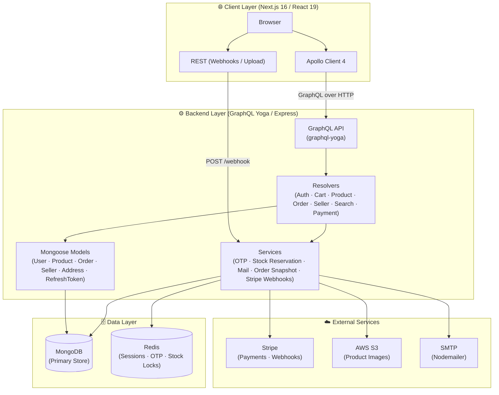
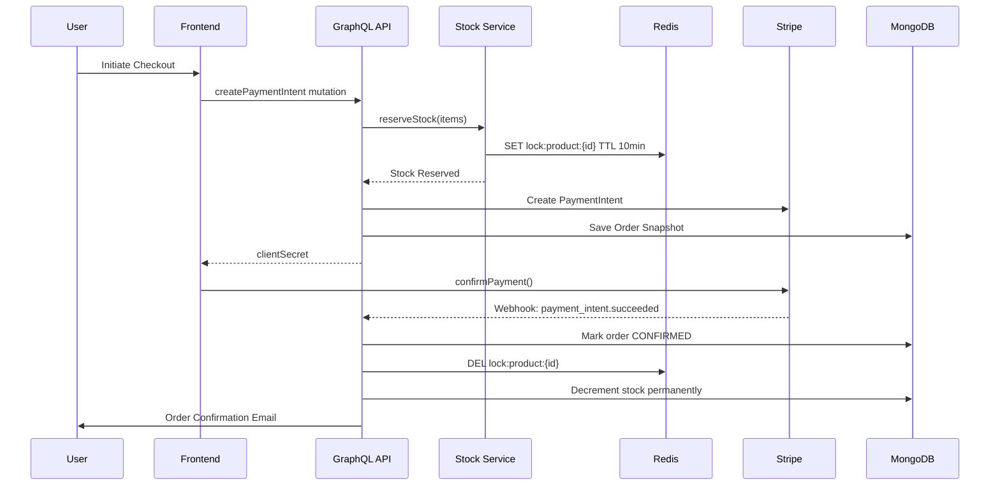

<div align="center">

# ⚡ Zynora

### *Commerce, Redefined. Performance, Engineered.*

[](https://nextjs.org/)
[](https://react.dev/)
[](https://the-guild.dev/graphql/yoga-server)
[](https://mongoosejs.com/)
[](https://redis.io/)
[](https://www.typescriptlang.org/)
[](https://stripe.com/)
[](https://aws.amazon.com/s3/)
[](LICENSE)

**A production-grade, full-stack multi-vendor e-commerce platform built on a high-performance monorepo architecture.**  
Zynora delivers a seamless buying and selling experience — from dynamic storefronts to atomic inventory management and real-time payment orchestration.

[Live Demo](#) · [Report Bug](https://github.com/yourusername/zynora/issues) · [GitHub Repo](https://github.com/yourusername/zynora)

</div>

---

## 🚀 Introduction

Modern e-commerce platforms suffer from three fundamental problems: **monolithic architectures that don't scale**, **fragile payment flows that lose revenue**, and **poor seller tooling that drives vendors away**.

**Zynora** was engineered to solve all three.

It is a **multi-vendor marketplace** built on a decoupled monorepo — a dedicated TypeScript/GraphQL backend paired with a Next.js 16 React 19 frontend — connected via a type-safe Apollo Client. Every design decision from atomic stock reservation to webhook-driven payment reconciliation was made with production reliability and developer experience in mind.

---

## 🧠 Why This Project Stands Out

This isn't a CRUD app with a payment button bolted on. Here's what was technically challenging to get right:

| Challenge | Solution |
|---|---|
| **Race conditions on stock** | Atomic stock reservation service using Redis-backed locks, preventing overselling across concurrent checkouts |
| **Secure token rotation** | Refresh token rotation with `argon2` hashing stored in MongoDB + Redis, mitigating token replay attacks |
| **OTP brute-force prevention** | Rate-limited OTP service with TTL-based Redis storage for stateless session validation |
| **Order integrity** | Immutable order snapshot service — product price & details are captured at checkout time, independent of future catalog changes |
| **Webhook idempotency** | Stripe webhook handler with event deduplication to prevent double-processing of payment events |
| **Presigned media uploads** | AWS S3 presigned URL generation for direct client-to-S3 uploads, removing backend from the upload path |
| **Type-safe full-stack** | Shared `packages/types` used by both apps ensures compile-time safety across the monorepo boundary |

---

## 🛠️ Tech Stack

### Backend
| Category | Technology |
|---|---|
| Runtime | Node.js + TypeScript 5 |
| API Layer | GraphQL Yoga 5 (GraphQL 16) |
| Database | MongoDB 9 via Mongoose |
| Caching & Sessions | Redis 5 |
| Authentication | JWT (jsonwebtoken) + Argon2 password hashing |
| Payments | Stripe SDK 20 |
| File Storage | AWS S3 + Presigned URLs (`@aws-sdk/client-s3`) |
| Email | Nodemailer 8 |
| Validation | Zod 4 |
| Dev Server | tsx watch (hot-reload TypeScript execution) |

### Frontend
| Category | Technology |
|---|---|
| Framework | Next.js 16 (App Router) |
| UI Library | React 19 |
| GraphQL Client | Apollo Client 4 |
| Styling | TailwindCSS 4 |
| Animation | Framer Motion 12 |
| UI Components | Radix UI primitives |
| Forms | React Hook Form 7 + Zod 4 |
| Payments | Stripe React + Razorpay |
| Notifications | React Hot Toast |
| Carousel | Swiper.js 12 |
| Device Fingerprint | FingerprintJS 5 |

### Infrastructure & Tooling
| Category | Technology |
|---|---|
| Monorepo | Turborepo-compatible workspace (npm workspaces) |
| Containerization | Docker (multi-service compose setup) |
| Language | TypeScript 5 across all packages |
| Shared Packages | `packages/models`, `packages/types`, `packages/utils` |

---

## 🏗️ System Architecture



### Data Flow: Checkout & Payment


---

## ✨ Core Features

### 🛍️ Storefront & Discovery
- Full-featured product listing pages (SRP) with faceted filtering and Swiper-powered carousels
- Product detail pages (PDP) with variant selection, real-time stock indicators, and image galleries hosted on AWS S3
- Intelligent search resolver with keyword-based product discovery

### 👤 Authentication & Identity
- **Email/OTP login** — stateless OTP flow via Redis with configurable TTL
- **JWT with rotation** — short-lived access tokens + secure HttpOnly cookie-stored refresh tokens, hashed with Argon2 before persistence
- **FingerprintJS** device binding adds a layer of session authenticity verification
- Token refresh handled transparently by Apollo Client link middleware

### 🛒 Cart & Order Management
- Server-side cart stored in MongoDB, synchronized with client state via Apollo cache
- Immutable **order snapshots** — price, product state, and seller info are captured atomically at purchase time
- Full order history with status tracking accessible from the buyer's profile

### 🏪 Multi-Vendor Seller Portal
- Dedicated seller registration and KYC flow with document upload to AWS S3 via presigned URLs
- Seller-specific product registration with multi-variant support (size, color, stock per SKU)
- Seller dashboard with order management and inventory controls

### 💳 Payments
- **Stripe** integration with full webhook support for payment reconciliation (`payment_intent.succeeded`, `payment_intent.payment_failed`)
- **Razorpay** integration for INR-native checkout flows
- Webhook endpoint with event signature verification and idempotent processing

### 📬 Transactional Email
- Nodemailer-powered mail service for OTP delivery, order confirmation, and seller notifications
- Template-driven email generation for consistent branding

---

## 🔐 Security & Performance

### Security
- **Argon2id** password and token hashing — industry-recommended over bcrypt for memory-hardness
- **HttpOnly + Secure cookies** for refresh tokens — inaccessible to JavaScript, preventing XSS token theft
- **JWT access token rotation** — old refresh tokens are invalidated on each use
- **Zod schema validation** on all inputs at both API and form layers
- **Stripe webhook signature verification** on every incoming event
- **AWS S3 presigned URLs** — time-limited, scoped upload permissions without exposing credentials

### Performance
- **Next.js App Router** with React Server Components for zero-JavaScript server-rendered pages where applicable
- **Redis caching** for OTP sessions and stock locks — sub-millisecond reads
- **Direct client-to-S3 uploads** via presigned URLs — backend never touches binary upload data
- **Apollo Client cache** with normalized entity caching reduces redundant GraphQL requests
- **Framer Motion** animations are GPU-accelerated and respect `prefers-reduced-motion`

---

## 🗄️ Database Design

### Core Models

**User** — `email`, `passwordHash`, `role (buyer | seller | admin)`, `isVerified`, `createdAt`

**Product** — `title`, `description`, `category`, `basePrice`, `sellerId`, `variants[]` `{sku, size, color, stock, price}`, `images[]`, `status (draft | active | archived)`

**Order** — `buyerId`, `sellerId`, `snapshot{}` (immutable product+price capture), `status`, `paymentIntentId`, `stripeEventId`, `createdAt`

**Seller** — `userId`, `businessName`, `gstin`, `panNumber`, `bankDetails{}`, `verificationStatus`, `documents[]`

**RefreshToken** — `userId`, `tokenHash`, `deviceFingerprint`, `expiresAt`

**UserAddress** — `userId`, `addressLines`, `city`, `state`, `pincode`, `isDefault`

---

## 📡 API Design

Zynora exposes a single **GraphQL endpoint** (`/graphql`) composed from domain-specific resolvers:

| Domain | Key Operations |
|---|---|
| **Auth** | `signup`, `login`, `verifyOTP`, `refreshToken`, `logout` |
| **Product** | `getProduct`, `listProducts`, `searchProducts`, `createProduct` (seller) |
| **Cart** | `getCart`, `addToCart`, `removeFromCart`, `updateCartItem` |
| **Order** | `createOrder`, `getOrders`, `getOrderById` |
| **Payment** | `createPaymentIntent`, `confirmPayment` · Webhook: `POST /api/webhook/stripe` |
| **Seller** | `registerSeller`, `getSellerProfile`, `getSellerOrders`, `updateProduct` |
| **Address** | `addAddress`, `getAddresses`, `setDefaultAddress` |
| **File Upload** | `getPresignedUrl` — returns time-limited S3 upload URL |
| **UI/Home** | `getHomepageData` — curated banners, featured products |

All mutations are protected by JWT middleware. Role-based access control (`buyer` / `seller` / `admin`) is enforced at the resolver level.

---

## 📸 Screenshots / Demo

> *Screenshots will be added upon live deployment. UI features include:*
> - Glassmorphism-styled product cards with hover micro-animations
> - Multi-step seller registration wizard
> - Stripe-embedded payment sheet
> - Responsive mobile-first layout

---

## ⚙️ Getting Started

### Prerequisites

| Tool | Version |
|---|---|
| Node.js | ≥ 20.x |
| npm | ≥ 10.x |
| MongoDB | ≥ 7.x (or Atlas URI) |
| Redis | ≥ 7.x |
| AWS Account | S3 Bucket configured |
| Stripe Account | API keys + webhook secret |

### 1. Clone the Repository

```bash
git clone https://github.com/yourusername/zynora.git
cd zynora
```

### 2. Install All Dependencies

```bash
# Install dependencies for all workspaces from root
npm install
```

### 3. Configure Environment Variables

**Backend** — create `apps/backend/.env`:

```env
PORT=4000
MONGODB_URI=mongodb://localhost:27017/zynora
REDIS_URL=redis://localhost:6379

JWT_ACCESS_SECRET=your_access_secret
JWT_REFRESH_SECRET=your_refresh_secret
JWT_ACCESS_EXPIRY=15m
JWT_REFRESH_EXPIRY=7d

AWS_ACCESS_KEY_ID=your_aws_key
AWS_SECRET_ACCESS_KEY=your_aws_secret
AWS_REGION=ap-south-1
S3_BUCKET_NAME=zynora-assets

STRIPE_SECRET_KEY=sk_test_...
STRIPE_WEBHOOK_SECRET=whsec_...

SMTP_HOST=smtp.gmail.com
SMTP_PORT=587
SMTP_USER=your@email.com
SMTP_PASS=your_app_password
```

**Frontend** — create `apps/frontend/.env.local`:

```env
NEXT_PUBLIC_GRAPHQL_URL=http://localhost:4000/graphql
NEXT_PUBLIC_STRIPE_PUBLISHABLE_KEY=pk_test_...
NEXT_PUBLIC_RAZORPAY_KEY_ID=rzp_test_...
NEXTAUTH_SECRET=your_nextauth_secret
NEXTAUTH_URL=http://localhost:3000
```

### 4. Start Development Servers

```bash
# Start backend (runs on :4000)
cd apps/backend
npm run dev

# In a new terminal — start frontend (runs on :3000)
cd apps/frontend
npm run dev
```

### 5. (Optional) Docker Setup

```bash
# Start MongoDB and Redis via Docker Compose
docker compose -f docker/docker-compose.yml up -d
```

Open [http://localhost:3000](http://localhost:3000) in your browser.

---

## 📁 Project Structure

```
zynora/
├── apps/
│   ├── backend/                  # GraphQL Yoga API server
│   │   ├── graphql/
│   │   │   ├── schema/           # GraphQL type definitions (domain-split)
│   │   │   └── resolvers/        # Domain resolvers (auth, cart, product, order, seller, payment...)
│   │   ├── model/                # Mongoose models (User, Product, Order, Seller, RefreshToken, Address)
│   │   ├── services/             # Business logic (OTP, stock reservation, mail, order snapshot, Stripe)
│   │   ├── lib/                  # External connections (MongoDB, Redis)
│   │   ├── middleware/           # Auth middleware (JWT validation)
│   │   ├── utils/                # Token generation, client IP helpers
│   │   ├── constants/            # App-wide constants
│   │   └── server.ts             # Express + GraphQL Yoga entry point
│   │
│   └── frontend/                 # Next.js 16 App Router frontend
│       └── src/
│           ├── app/              # Next.js App Router (pages, layouts, API routes)
│           ├── components/       # UI Components (cart, pdp, srp, seller portal, profile...)
│           ├── graphql/          # Client-side queries, mutations, merged typeDefs
│           ├── apollo/           # Apollo Client config + token refresh link
│           ├── providers/        # ApolloWrapper, StripeProvider context
│           ├── services/         # Client-side service calls
│           ├── middleware/       # Next.js middleware (auth route protection)
│           ├── model/            # Mongoose (SSR usage)
│           ├── lib/              # MongoDB, Redis client init (SSR)
│           ├── helper/           # Business logic helpers
│           ├── schemas/          # Zod form validation schemas
│           ├── types/            # TypeScript interfaces
│           └── utils/            # Utility functions
│
├── packages/
│   ├── models/                   # Shared Mongoose models (used across apps)
│   ├── types/                    # Shared TypeScript types & interfaces
│   └── utils/                    # Shared utility functions
│
├── docker/                       # Docker Compose for local infrastructure
└── scripts/                      # Workspace automation scripts
```

---

## 🧪 Future Improvements

| Priority | Feature | Notes |
|---|---|---|
| 🔴 High | **Full-text search with Elasticsearch** | Replace MongoDB text indexes for scalable search with relevance ranking |
| 🔴 High | **Admin dashboard** | Order oversight, seller verification, revenue analytics |
| 🟡 Medium | **Real-time order tracking** | GraphQL Subscriptions over WebSocket for live order status updates |
| 🟡 Medium | **Review & rating system** | Verified purchase reviews with media uploads |
| 🟡 Medium | **Recommendation engine** | Collaborative filtering based on purchase and browse history |
| 🟢 Low | **Internationalization (i18n)** | Multi-currency and multi-language support |
| 🟢 Low | **PWA support** | Service worker for offline browsing and push notifications |
| 🟢 Low | **E2E test suite** | Playwright tests covering critical checkout and auth flows |

---

## 🤝 Contributing

Contributions are welcome! Here's how to get started:

1. **Fork** the repository
2. **Create** a feature branch: `git checkout -b feature/your-feature-name`
3. **Commit** your changes: `git commit -m 'feat: add your feature'`
4. **Push** to the branch: `git push origin feature/your-feature-name`
5. **Open** a Pull Request

Please follow [Conventional Commits](https://www.conventionalcommits.org/) for commit messages and ensure your code passes TypeScript compilation before submitting.

---

## 👨‍💻 Author

<div align="center">

**Ankit Shukla**

*Full-Stack Engineer · System Design Enthusiast*

[](https://github.com/ankitshukla)
[](https://linkedin.com/in/ankitshukla)

*Built with passion for engineering-first software. Open to exciting full-stack opportunities.*

</div>

---

<div align="center">

**⭐ If Zynora impressed you, drop a star — it means a lot!**

*© 2026 Ankit Shukla · ISC License*

</div>
